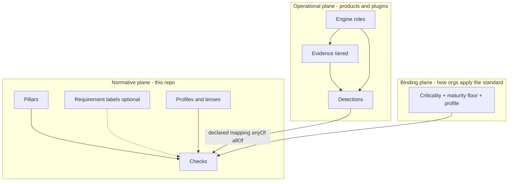
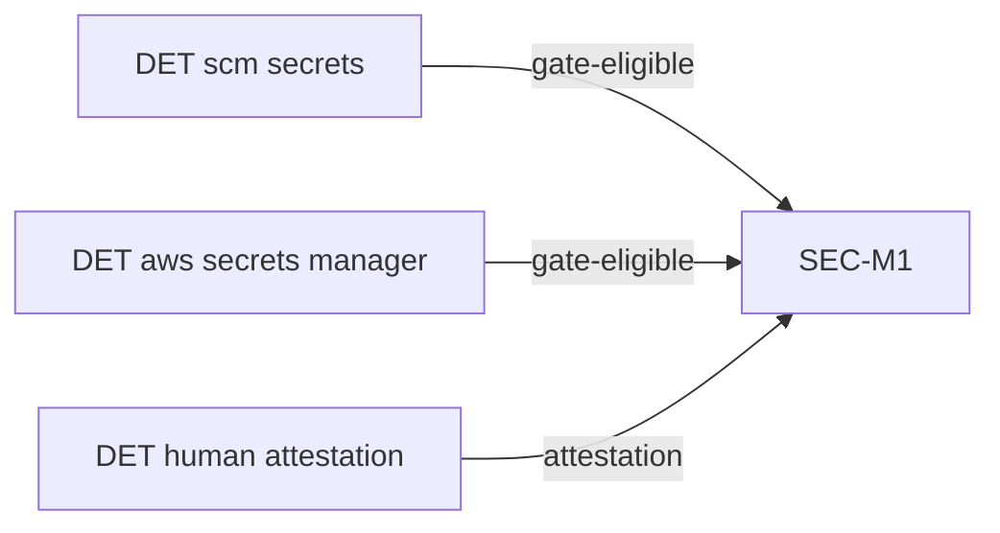
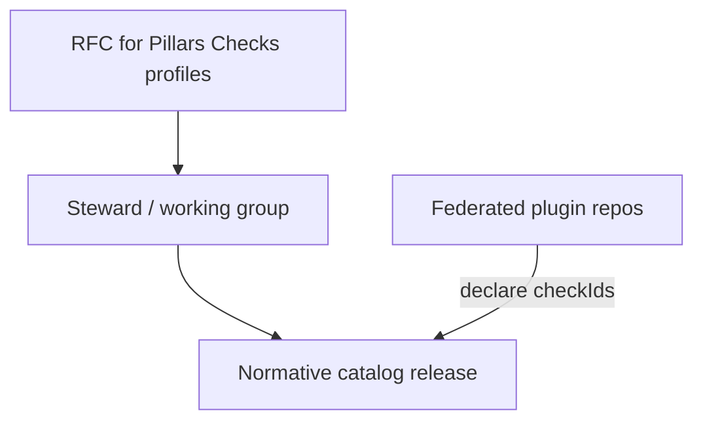
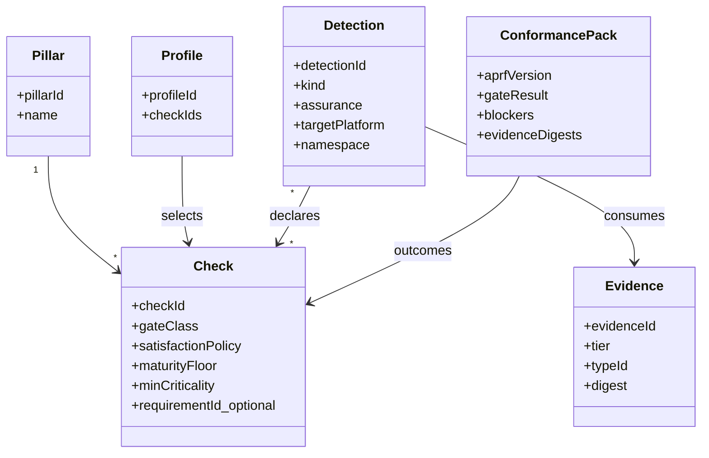
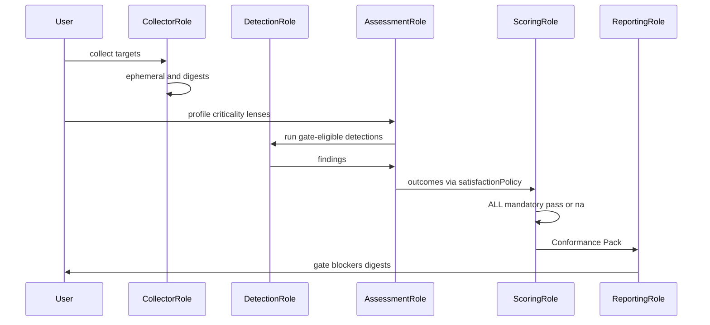

# APRF architecture

**Status:** hardened design target (post adversarial review)  
**Framework SemVer today:** v0.10.0  
**Companion:** [ARCHITECTURE-REVIEW.md](ARCHITECTURE-REVIEW.md) (panel critique → accepted changes)

APRF is an **engineering readiness standard** for whether an AI application can safely operate in production. It is **not** a vulnerability scanner, **not** a CNAPP, and **not** a SOC 2 / ISO certification program.

The public standard must remain citable for a decade. Implementations (collectors, detectors, UIs) must evolve without RFCs to the Pillar list.

## Hard invariants

1. **Normative vs operational split.** This repository owns Pillars, Checks (and optional Requirement *labels*), profiles/lenses, schemas, RFCs. Detections, Evidence stores, and engines are **products/plugins**.
2. **Gates are binary.** Mandatory Checks are `pass` | `fail` | `na`. No org-wide “readiness %.”
3. **Stable Check IDs.** Preserve the published namespace (`AUTHN-M1`, `SEC-M1`, …). Deprecate; never reuse; do not renumber to `SEC-001`.
4. **Platform names stay out of Checks.** Principles in Checks; platforms only in Detections.
5. **Plugin listing ≠ conformance.** Vocabulary: `reference` | `signed` | `reviewed` — never “certified ready.”
6. **Evidence digests are immutable;** raw payloads may be ephemeral (tiered retention).

---

## Planes (not five equal layers)

Adversarial review rejected a mandatory five-deep hierarchy for humans. The industry-standard shape is **three planes**:

| Plane | Contents | Change cadence |
| --- | --- | --- |
| **Normative** | Pillars, Checks, optional Requirement labels, profiles/lenses, crosswalks (informative) | Slow; RFC |
| **Binding** | Which Checks apply (criticality, maturity floor, profile, N/A policy) | Per assessment |
| **Operational** | Evidence, Detections, collectors, engines, UIs | Continuous; plugin SemVer |

### Why not mandatory Pillar → Requirement → Check?

OWASP/WA-style standards win with a **shallow public surface**. Requirements remain valuable as **documentation groupings** (`requirementId` on a Check) so principles can be explained once — they are **not** a required evaluation hop and not required in attestation gate logic.

### Pillars (normative)

- Stable taxonomy (~order 10–20). Almost never added.
- New Pillar = exceptional RFC + stewardship consensus + “10-year stability” bar.
- Soft **Check budget** per Pillar (~25–40) to prevent catalog bloat.

### Checks (normative)

Machine-evaluable or attest-able expectations.

**Shipped today (v0.10 YAML / `rule.schema.json`):** `id`, `title`, `description`, `whyItMatters`, `severity`, `weight`, `gate` (`mandatory` | `recommended`), `passCondition`, `evidenceRequired[]`, `detection`, `manualVerification`, `falsePositiveGuidance`, `recommendedFixes`, `references[]`, `relatedRules[]`, `tags[]`, `applicability` (`minCriticality`, `requiredFromLevel`, optional technologies/profiles/lenses), `status`, optional deprecation fields.

**Target model (RFC / future — not yet the on-disk schema):**

- `checkId` (alias of today’s `id`)
- `gateClass` (alias of today’s `gate`)
- `maturityFloor` / `minCriticality` (already partially shipped as `applicability.*`)
- `successCriteria` / `failureCriteria` (today: `passCondition`)
- `requiredEvidenceTypes[]` (IDs from a future Evidence Type Registry)
- `satisfactionPolicy`: `anyOf` (default) | `allOf` | `attestationOnly`
- Optional `requirementId` (documentation label)

**Forbidden in Checks:** CVE IDs as gate criteria; “satisfies SOC 2 CC6.1”; product/platform names in titles; `scoringWeight` on **mandatory** Checks.

### Profiles and lenses (normative selectors)

Core / Regulated / custom profiles and lenses (RAG, Agents, …) are **sets of Check IDs**, not new layers and not Detections. In this repo they are exported from `@stackrail-io/aprf-framework-definition` and mirrored in `spec/aprf-spec.json`.

### Detections (operational — not in this repo’s normative catalog)

- `detectionId`, `pluginId`, `targetPlatform`, `namespace` (`scm` | `infra` | `ai-runtime` | …)
- `kind`: `deterministic` | `stochastic`
- `assurance`: `gate-eligible` | `signal-only`
- `checkIds[]` — plugin-**declared** edges
- Evidence consumed; FP guidance; version; signature metadata

**Rules:**
- Stochastic detections **cannot alone** satisfy a mandatory Check (`assurance` must be `signal-only` unless paired with deterministic corroboration or human attestation).
- Many Detections → one Check; one Detection → many Checks (graph). Sufficiency is the Check’s `satisfactionPolicy` (target model) or attestation + product mapping today.

### Evidence (operational)

| Tier | Retention | Immutable? |
| --- | --- | --- |
| `ephemeral` | TTL (product-defined) | Content-addressed while held |
| `digest` | Long-lived hash + metadata | Yes |
| `attested` | Explicit pack (human/CI upload) | Yes |

PII/residency handled by products; the standard requires digests in the Conformance Pack, not raw clouds of traces.

### Evidence Type Registry (planned)

**Not shipped in this repository yet.** Future normative home for versioned evidence *kind* IDs + JSON schemas (e.g. `git.repo_snapshot`, `k8s.manifest`, `otel.trace_summary`, `prompt.bundle`) — analogous to OpenTelemetry semantic conventions. Until that lands, Checks use free-form `evidenceRequired[]` strings. New platforms should prefer new evidence types (once registered) over new Checks when principles already exist.

---

## Mapping and satisfaction

Default Check policy `anyOf`: one `gate-eligible` pass **or** valid attestation satisfies the Check. Coverage reports may show “no gate-eligible Detection for this stack” without failing until assessment runs.

Plugins **declare** mappings; products **aggregate** and validate against the pinned catalog. The standard does **not** maintain a central 5,000-edge hand-edited table.

---

## Engine roles (reference — any vendor may implement)

Engines are **roles**, not a required StackRail monolith.

| Role | Responsibility |
| --- | --- |
| Collector | Produce Evidence (tiered) |
| Detection | Emit findings with `checkIds`, kind, assurance |
| Mapping validate | Join declarations to catalog; enforce satisfactionPolicy |
| Assessment | Apply profile/criticality/N/A → outcomes |
| Scoring | Gate = ALL mandatory ∈ {pass, na}; optional **per-Pillar** recommended backlog metrics — **never** one readiness % |
| Recommendation | Order failed Checks by severity × criticality |
| Reporting | Emit **Conformance Pack** |

### Conformance Pack (enterprise artifact)

Minimum normative output of an assessment:

1. Pinned `aprfVersion` + profile/lens IDs  
2. Gate result (`pass`/`fail`)  
3. Blockers (failed mandatory Check IDs + titles)  
4. Capability attained vs required (if used)  
5. Evidence index of **digests** (and attested packs), not necessarily raw blobs  
6. Explicit disclaimer: self-attestation ≠ third-party certification; crosswalks informative only  

---

## Versioning

| Line | Scope |
| --- | --- |
| **Framework SemVer** | Pillars, Checks, profiles, gate semantics |
| **Schema versions** | Spec / attestation / evidence-type document shapes (e.g. [spec-schema/0.7](https://stackrail.io/aprf/spec-schema/0.7)) — independent of framework SemVer |
| **Plugin SemVer** | Collectors/Detections; declare `compatibleFramework` range |
| **Evidence Type Registry SemVer** | Additive types preferred; breaking type changes get new type IDs |

---

## Budgets and anti-explosion rules

- Soft cap Checks per Pillar; RFC must justify non-overlap.
- MAX new Checks per MINOR without stewardship exception vote.
- Platform/product names banned from Check titles.
- New agent/cloud frameworks → Detections + Evidence types first; Checks only for new **principles**.
- Detection namespaces discourage “one plugin one Check” spam.

---

## Governance

| Change | Approval |
| --- | --- |
| Pillar add/remove | Exceptional RFC + consensus |
| Check add/change/deprecate | RFC; ID immutability |
| Requirement labels | Editorial or PATCH/MINOR; non-gating |
| Evidence type add | Registry PR; prefer additive |
| Detection / collector | Plugin maintainers; optional `reviewed`/`signed` listing |
| Breaking gate semantics | MAJOR + long review |

Stewards do **not** review all Detection logic. They own catalog integrity and vocabulary discipline.

Deprecation: `deprecated` + `replacedBy` + N−1 MINOR support window; mandatory→recommended needs RFC.

---

## Structural view

## Assessment sequence

---

## Non-goals

- Competing with SAST/SCA/CNAPP as a CVE or misconfiguration product
- Org-wide vanity readiness scores
- Embedding cloud APIs in the normative catalog
- “Certified plugin ⇒ production ready”
- Renumbering published Check IDs

---

## Design outcome

A **shallow, stable, citable standard** (Pillars + Checks + profiles) with a **federated operational ecosystem** (Evidence types, Detections, engine roles) that absorbs new models, runtimes, and clouds **without Pillar churn** — positioned to sit beside Well-Architected, OWASP, and CIS as the AI production-readiness reference.

Catalog content and ID migration from today’s collapsed check objects remain RFC work; this document freezes the **architecture**.
