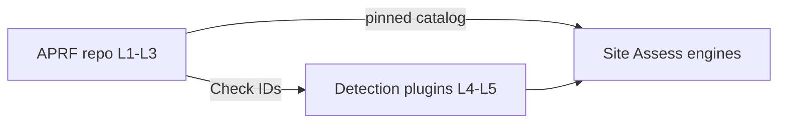
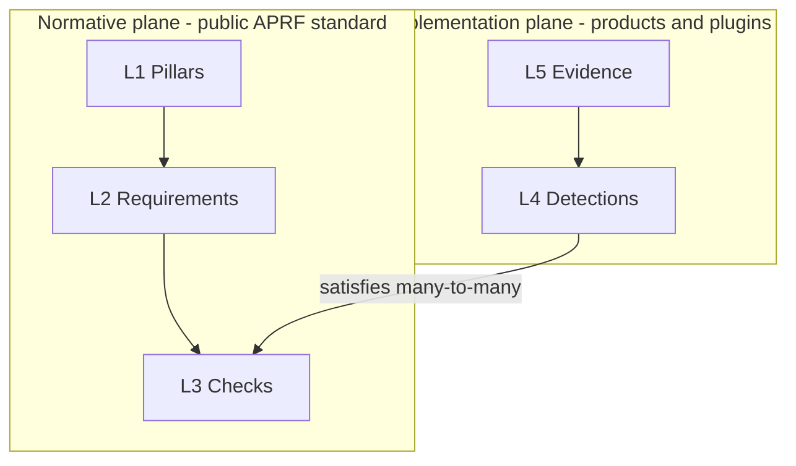
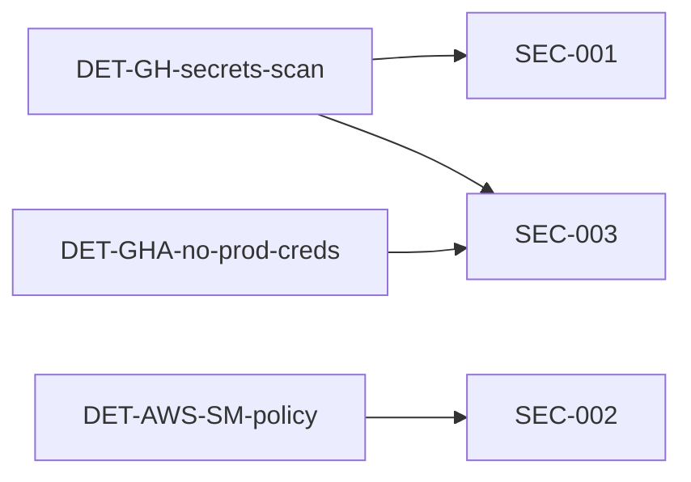
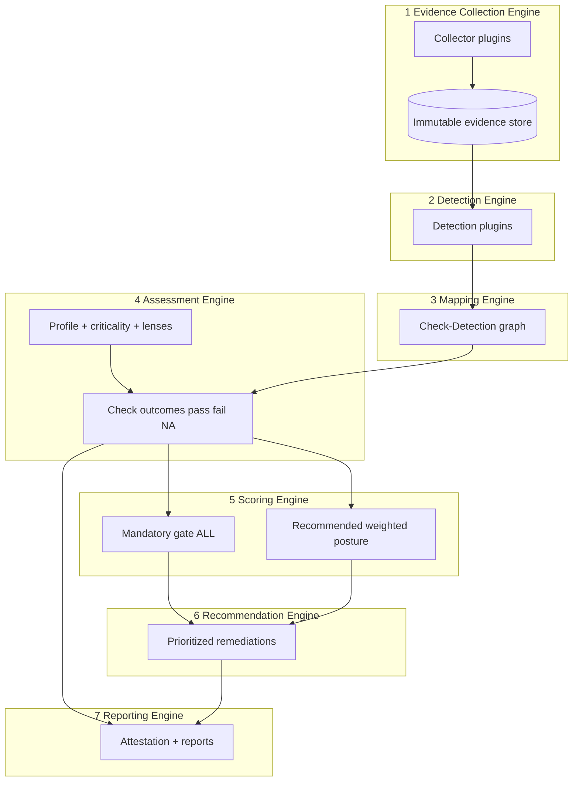
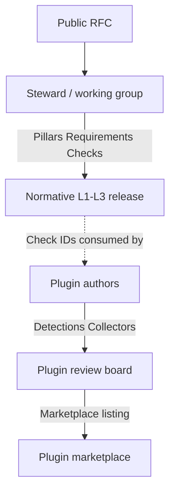
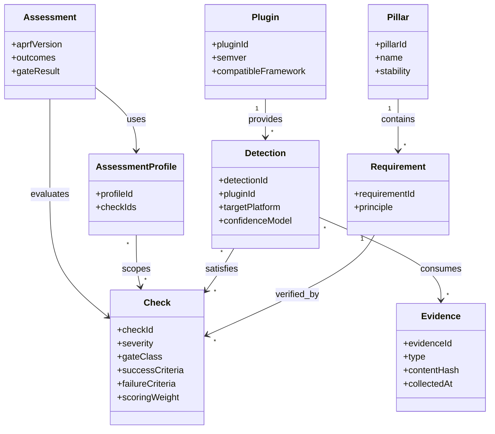
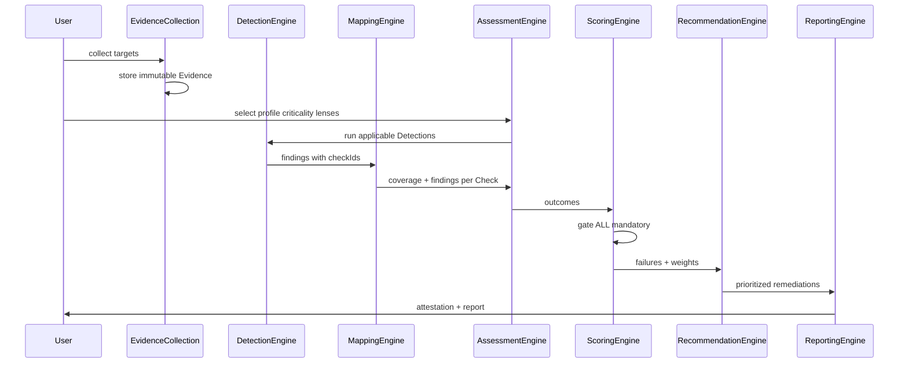

# APRF architecture

**Status:** design target (working draft)  
**Framework SemVer today:** v0.10.0 (catalog still published as pillars + checks; Requirements layer is the next normative split)  
**This document:** normative *architecture* — not Detection/plugin source code

APRF is an **engineering readiness standard**, not a vulnerability scanner and not a compliance checkbox engine. The public framework must remain stable for years while implementations evolve independently.

Design lessons adapted from Kubernetes, AWS Well-Architected, OWASP, CIS Benchmarks, OpenTelemetry, and NIST CSF:

| Peer | Lesson for APRF |
| --- | --- |
| Kubernetes | Stable API surface; implementations evolve behind versioned contracts |
| AWS Well-Architected | Shallow pillars; depth in questions — not product lock-in |
| OWASP | Public, citable controls; tooling is separate from the standard |
| CIS Benchmarks | Auditable recommendations + evidence expectations; scanners consume benchmarks |
| OpenTelemetry | Semantic conventions stay stable; exporters/receivers are plugins |
| NIST CSF | Functions/categories evolve slowly; profiles map to organizations |

## Hard invariants

1. **Normative vs implementation split is absolute.** Layers 1–3 are the public standard. Layers 4–5 and runtime engines are products/plugins.
2. **Gates stay binary.** Mandatory Checks are pass / fail / N/A. Scoring weight prioritizes remediation order and recommended posture — it never averages a failed mandatory Check into a vanity readiness percentage.
3. **Stable IDs.** Once published in a MINOR+, Pillar / Requirement / Check IDs are immutable; deprecate, never reuse.
4. **Many-to-many mappings.** Detections ↔ Checks is a **graph**, not a tree.
5. **Evidence is immutable.** Append-only content-addressed artifacts; reinterpretation happens via new Detection runs, not mutation.

## Where this lives

| Concern | Home |
| --- | --- |
| L1 Pillars, L2 Requirements, L3 Checks, governance, RFCs | **This repository** ([stackrail-io/APRF](https://github.com/stackrail-io/APRF)) |
| L4 Detections, L5 Evidence, Plugin SDK, marketplace | Product / plugin repos (not the public standard) |
| Assess UI, engines, SEO | StackRail site / products (e.g. [stackrail.io/aprf](https://stackrail.io/aprf/)) |

---

## Five layers

| Layer | Stabilizes | Changes when | Analogy |
| --- | --- | --- | --- |
| **L1 Pillars** | Taxonomy of engineering concern | Rare (decades); RFC + MAJOR only | WA pillars / NIST functions |
| **L2 Requirements** | Engineering principles (“shall”) | Slow; RFC MINOR | WA design principles / CSF categories |
| **L3 Checks** | Measurable expectations + evidence contract | Controlled; RFC MINOR/PATCH | CIS recommendations / OWASP controls |
| **L4 Detections** | How to observe a Check on a platform | Continuous; plugin releases | OTel exporters / CIS Assessor rules |
| **L5 Evidence** | Raw immutable observations | Every scan/collection | Logs, configs, traces as inputs |

**Future-proofing without architecture change:**

- New AI frameworks → Detection plugins + Evidence types; Checks unchanged if principles hold
- New clouds / Kubernetes / languages → new collectors/detectors; same Check IDs
- New models / MCP / A2A → Evidence schemas + Detections mapped to existing Checks
- New deployment platforms → plugins only

Scale targets (20 Pillars / 200+ Requirements / 500+ Checks / 5,000+ Detections / 100+ Plugins) are **data volume**, not new layers.

### L1 — Pillar

- `pillarId` (stable, e.g. `APRF-P-SEC`)
- `name`, `summary`, `purpose`
- `stability: frozen | active | deprecated`
- Owns many Requirements

Pillars almost never change. Adding a Pillar is an exceptional governance event.

### L2 — Requirement

- `requirementId` (e.g. `APRF-R-SEC-SECRETS-HARDCODE`)
- `pillarId`
- `principle` (normative “shall” prose)
- `rationale`, `nonGoals`

Stable over years; editorial clarifications via PATCH. Today’s inline check `requirement` string splits into L2 principle + L3 measurable Check.

### L3 — Check (normative; part of APRF spec)

- `checkId` (e.g. `SEC-001`)
- `requirementId`
- `title`, `description`
- `severity` (critical | high | medium | low)
- `category` (automated | manual | hybrid, plus taxonomy tags)
- `requiredEvidence` (L5 artifact types)
- `successCriteria`, `failureCriteria`
- `scoringWeight` (recommended posture / prioritization — **not** for overriding gates)
- `gateClass`: `mandatory` | `recommended`
- `maturityFloor`, `minCriticality` (dual maturity × criticality)
- `references`, `deprecated`, `replacedBy`

### L4 — Detection (NOT in the public framework)

- `detectionId`, `pluginId`, `targetPlatform`
- `logicRef`, `evidenceConsumed[]`, `checkIds[]` (many-to-many)
- `confidenceModel`, `falsePositiveGuidance`
- Optional `producesEvidence[]`

### L5 — Evidence

- `evidenceId` (content hash), `type`, `source`, `collectedAt`
- `payloadRef`, `provenance`
- Never updated in place; superseded by new collection runs

### Mapping graph (L4 ↔ L3)

Assessment asks: *for each in-scope Check, is there sufficient Evidence via any covering Detection (or attested manual path)?* Not: *did detector X run?*

---

## Relationship to the published catalog today

The current machine-readable catalog ([`spec/aprf-spec.json`](spec/aprf-spec.json)) collapses L2+L3 into one check object and has no L4/L5.

| Today | Target |
| --- | --- |
| Domain + Pillar | L1 Pillar (domains become optional grouping metadata) |
| Check requirement prose | L2 Requirement |
| Check + artifact + pass condition | L3 Check |
| Assess quiz / CI scripts | L4 Detections + Assessment Engine |
| Attestation JSON | Report over L3 outcomes; Evidence refs optional |
| Lenses / Profiles | Assessment profiles selecting Check sets (still normative) |

This repository remains **Layers 1–3 + governance**. Products ship **Layers 4–5 + engines** separately.

---

## Runtime engines (logical components)

### 1. Evidence Collection Engine

Schedules collectors; normalizes typed Evidence; content-hashes; records provenance. Pluggable by platform. Never interprets pass/fail.

### 2. Detection Engine

Loads Detection plugins against Evidence; emits findings (candidate Check satisfaction / violation) with confidence. Deterministic given Evidence + Detection version + config.

### 3. Mapping Engine

Owns the Check↔Detection graph and coverage analysis. Supports manual attestation as first-class “virtual detections.”

### 4. Assessment Engine

Resolves scope (profile, criticality, lenses, N/A policy). For each in-scope Check: Detection findings + manual attestations → outcome. Produces machine-readable assessment documents.

### 5. Scoring Engine

- **Gate:** `ALL(mandatory outcomes ∈ {pass, na})` — fail closed
- **Capability attainment:** minimum across Pillars
- **Recommended score:** severity-weighted recommended Checks only — never mixes into the gate
- **Forbidden:** single blended “87% ready”

### 6. Recommendation Engine

Ordered backlog from failed Checks (severity, blast radius, dependencies). May cite which Detection failed without promoting Detection IDs into the standard.

### 7. Reporting Engine

Human reports, attestation JSON, evidence index, diffs vs prior assessment. Must cite **framework SemVer** and **schema versions** separately (e.g. APRF v0.10.0 vs [spec-schema/0.7](https://stackrail.io/aprf/spec-schema/0.7)).

### 8. Plugin SDK

Collector + Detection contracts: Evidence types, Check mappings, version, license, signature. Sandboxed execution; plugins must reference published L3 Check IDs.

### 9. Rule Authoring SDK

Author Detections against Check contracts; Evidence fixtures; false-positive corpus. Normative Check authoring stays in the **framework RFC process**, not the plugin SDK.

### 10. Versioning strategy

| Line | What | Bump when |
| --- | --- | --- |
| **Framework SemVer** | L1–L3 catalog + gate semantics | MAJOR: ID/semantics break; MINOR: add Pillar/Req/Check; PATCH: editorial |
| **Schema versions** | Document shapes (spec, attestation, evidence) | Only when JSON shape changes |
| **Plugin SemVer** | L4/L5 implementations | Independent; declare `compatibleFramework` range |

### 11. Backward compatibility

- Published Check IDs forever resolvable; deprecated Checks remain for an N−1 MINOR window
- Assessments pin `aprfVersion`; re-eval under newer versions is explicit migration
- Plugins mapping to removed Checks fail validation at load
- Additive fields preferred; breaking schema → new schema path (e.g. `spec-schema/0.8`)

### 12. Plugin marketplace

Registry of signed plugins: metadata, platforms, Check coverage matrix, trust level. **Certification ≠ APRF conformance.** A certified plugin means SDK contract + mapping validity — not that a customer system is production-ready.

### 13. Framework release process

1. RFC (draft → review → accepted)
2. Spec PR in this repo (Pillars / Requirements / Checks only)
3. Validate IDs, integrity, crosswalks
4. Tag framework SemVer; publish `spec/aprf-spec.json` + CHANGELOG
5. Site/reference Assess syncs catalog; plugins update on their own cadence

### 14. Deprecation strategy

- Mark `deprecated` + `replacedBy` + sunset MINOR
- Mandatory→recommended demotion requires RFC (gate semantics change)
- Detections for deprecated Checks warn; after sunset, mappings rejected

### 15. Governance model

| Change type | Who proposes | Who approves | Bar |
| --- | --- | --- | --- |
| New **Pillar** | RFC | Steward + exceptional consensus | Taxonomy gap; 10-year stability test |
| Evolve **Requirement** | RFC | Steward | Prefer new Requirement over rewrite |
| New/change **Check** | RFC | Steward / technical review | Measurable success/failure; evidence types |
| New **Detection** | Plugin PR / marketplace | Plugin maintainers (+ optional certification) | Valid mappings; fixtures; FP guidance |
| **Plugin certification** | Vendor/community | Program separate from normative WG | SDK conformance, signature, coverage accuracy |
| **Framework release** | Release captain | Steward quorum | SemVer + CHANGELOG + schema compatibility |
| **Breaking changes** | RFC MAJOR | Steward + long review | Migration guide; dual-publish period |

Public RFCs for L1–L3; open contribution for L4–L5 without polluting the standard.

---

## Structural view

## End-to-end assessment sequence

---

## Explicit non-goals

- Embedding cloud/vendor product APIs into the public spec
- Treating Detection confidence as certification
- Auto-filing CVEs or replacing AppSec scanners
- Equating crosswalks (NIST / ISO / SOC 2) with readiness gates

---

## Design outcome

A **stable public standard** (L1–L3) that can sit beside Well-Architected / OWASP / CIS for a decade, and an **unbounded implementation ecosystem** (L4–L5 + engines + marketplace) that absorbs new models, agent runtimes, clouds, and languages **without RFCs to the Pillar list**.

Ratify material catalog changes via [RFCs](rfcs/). Site stewardship: [stackrail.io/aprf/rfc](https://stackrail.io/aprf/rfc/).
