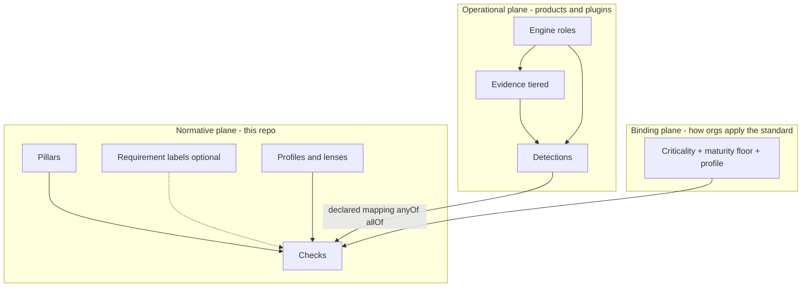
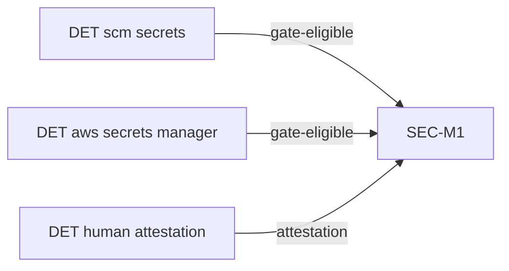
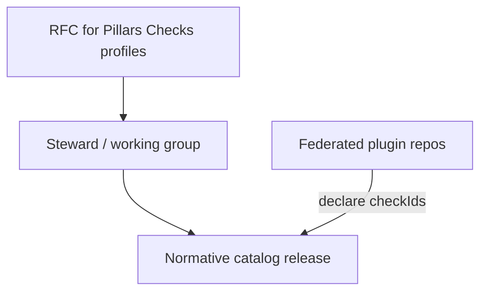
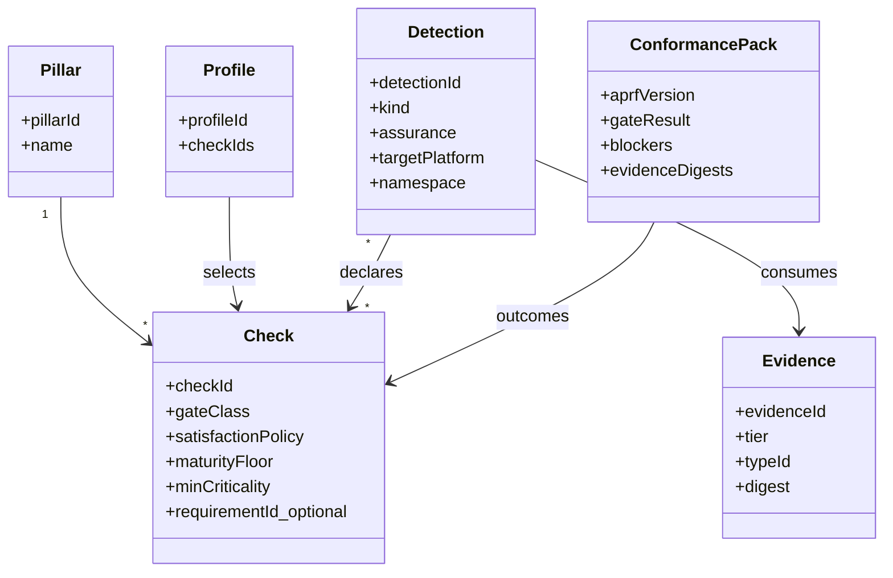
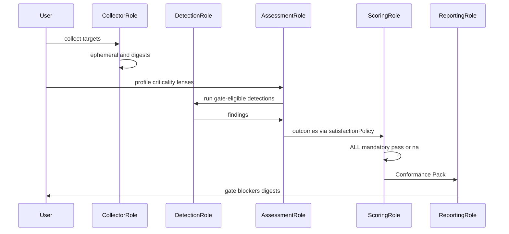
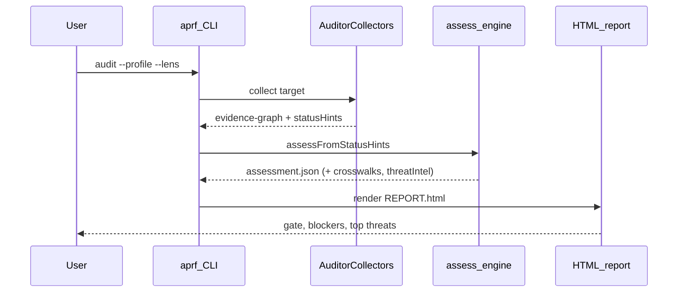

# APRF architecture

**Status:** hardened design (post adversarial review) + shipped local assessment path  
**Framework SemVer today:** v0.11.0 (catalog / gate semantics)  
**CLI / report packages today:** `@stackrail-io/aprf@0.1.x` (pins engine)  
**Companion:** [ARCHITECTURE-REVIEW.md](ARCHITECTURE-REVIEW.md) (panel critique → accepted changes)

APRF is an **engineering readiness standard** for whether an AI application can safely operate in production. It is **not** a vulnerability scanner, **not** a CNAPP, and **not** a SOC 2 / ISO certification program.

The public standard must remain citable for a decade. Implementations (collectors, detectors, UIs) must evolve without RFCs to the Pillar list. This repository also ships a **reference operational path** — the open CLI and auditor collectors — so adopters can assess without a proprietary backend.

## Hard invariants

1. **Normative vs operational split.** Normative artifacts stay in this repository: Pillars, Checks (and optional Requirement *labels*), profiles/lenses, schemas, RFCs, plus informative crosswalks/threat context. **Operational** execution is separate from the standard: this repo ships a **reference** path that **does** collect Evidence from target repos (and optional imports/live probes) via `skills/aprf-auditor` collectors, then assess/report with `@stackrail-io/aprf`. Products may replace or extend that path (other collectors, Evidence stores, UIs) but must not redefine Check IDs or gate semantics.
2. **Gates are binary.** Mandatory Checks are `pass` | `fail` | `na`. No org-wide “readiness %.”
3. **Stable Check IDs.** Preserve the published namespace (`AUTHN-M1`, `SEC-M1`, …). Deprecate; never reuse; do not renumber to `SEC-001`.
4. **Platform names stay out of Checks.** Principles in Checks; platforms only in Detections.
5. **Plugin listing ≠ conformance.** Vocabulary: `reference` | `signed` | `reviewed` — never “certified ready.”
6. **Evidence digests are immutable;** raw payloads may be ephemeral (tiered retention).

---

## Planes (not five equal layers)

Adversarial review rejected a mandatory five-deep hierarchy for humans. The industry-standard shape is **three planes**:



| Plane | Contents | Change cadence |
| --- | --- | --- |
| **Normative** | Pillars, Checks, optional Requirement labels, profiles/lenses, crosswalks + threat context (informative) | Slow; RFC for gate/taxonomy; additive metadata via map/sync scripts |
| **Binding** | Which Checks apply (criticality, maturity floor, profile, N/A policy) | Per assessment |
| **Operational** | Evidence, Detections, collectors, engines, UIs | Continuous; plugin SemVer — reference collectors/CLI live in this repo under `skills/aprf-auditor/` and `packages/aprf/` |

### Why not mandatory Pillar → Requirement → Check?

OWASP/WA-style standards win with a **shallow public surface**. Requirements remain valuable as **documentation groupings** (`requirementId` on a Check) so principles can be explained once — they are **not** a required evaluation hop and not required in attestation gate logic.

### Pillars (normative)

- Stable taxonomy (~order 10–20). Almost never added.
- New Pillar = exceptional RFC + stewardship consensus + “10-year stability” bar.
- Soft **Check budget** per Pillar (~25–40) to prevent catalog bloat.

### Checks (normative)

Machine-evaluable or attest-able expectations.

**Shipped today (v0.11 YAML / `rule.schema.json`):** `id`, `title`, `description`, `whyItMatters`, `severity`, `weight`, `gate` (`mandatory` | `recommended`), `passCondition`, `evidenceRequired[]`, optional `evidencePolicy` (`minimumTier` E0–E5, `acceptableEvidence[]` type IDs — [APRF-RFC-0011](rfcs/0011-evidence-assurance-tiers.md)), `detection`, `manualVerification`, `falsePositiveGuidance`, `recommendedFixes`, `references[]`, `relatedRules[]`, `tags[]`, `applicability` (`minCriticality`, `requiredFromLevel`, optional technologies/profiles/lenses / `appliesTo` / `notApplicableTo`), `status`, optional deprecation fields.

**Additive catalog metadata (not Check YAML fields — do not affect gate/score):** peer-framework **crosswalks** (from `spec/aprf-spec.json`) and per-Check **threat intel** (from `spec/aprf-threat-map.yaml`) are embedded into the generated catalog and surfaced on assessment controls / `REPORT.html`.

**Target model (RFC / future — not yet the on-disk schema):**

- `checkId` (alias of today’s `id`)
- `gateClass` (alias of today’s `gate`)
- `maturityFloor` / `minCriticality` (already partially shipped as `applicability.*`)
- `successCriteria` / `failureCriteria` (today: `passCondition`)
- `requiredEvidenceTypes[]` (full Evidence Type Registry schemas — starter IDs already via `evidencePolicy.acceptableEvidence` + `spec/evidence-types.yaml`)
- `satisfactionPolicy`: `anyOf` (default) | `allOf` | `attestationOnly`
- Optional `requirementId` (documentation label)

**Forbidden in Checks:** CVE IDs as gate criteria; “satisfies SOC 2 CC6.1”; product/platform names in titles; `scoringWeight` on **mandatory** Checks.

### Profiles and lenses (normative selectors)

Core / Regulated / custom profiles and lenses (RAG, Agents, …) are **sets of Check IDs**, not new layers and not Detections. In this repo they are exported from `@stackrail-io/aprf-framework-definition` and mirrored in `spec/aprf-spec.json`.

### Crosswalks and threat context (informative metadata)

These enrich assessments; they **never** change pass/fail, severity, weight, or evidence requirements.

| Artifact | Role |
| --- | --- |
| `spec/aprf-spec.json` → `crosswalks[]` | Peer frameworks (NIST AI RMF, ISO 42001, OWASP LLM Top 10 + AISVS bridges, AISVS, ASVS, OpenCRE, MAESTRO, FIASSE, SOC 2, AWS WA, SLSA, …) mapped to APRF Checks and/or pillar slugs. Pillar-only rows expand via Check `category`. Optional `relatedPeerControlIds` bridge peer controls across frameworks. |
| `spec/aprf-threat-map.yaml` | Per-Check `securityIntent`, `threats`, `protects`, optional MITRE ATLAS/ATT&CK IDs, `mappingRationale`. Full Check coverage required once the map exists. |
| `spec/mitre-technique-index.json` | Pinned offline technique IDs; `npm run aprf:threat-map` validates against it. |
| Generated catalog | `build-catalog` embeds both; `getCrosswalksForCheck` / `getThreatIntelForCheck` expose them. |

Reporting: each control may show crosswalks + threat chips/MITRE links; the executive summary ranks **Top threat exposure** across unmet controls (FAIL / PARTIAL / NOT_DEMONSTRATED), severity-weighted with mandatory Checks counting double. Unmet means unmitigated or unproven — not that an attack occurred.

### Detections (operational — not in this repo’s normative catalog)

- `detectionId`, `pluginId`, `targetPlatform`, `namespace` (`scm` | `infra` | `ai-runtime` | …)
- `kind`: `deterministic` | `stochastic`
- `assurance`: `gate-eligible` | `signal-only`
- `checkIds[]` — plugin-**declared** edges
- Evidence consumed; FP guidance; version; signature metadata

**Rules:**
- Stochastic detections **cannot alone** satisfy a mandatory Check (`assurance` must be `signal-only` unless paired with deterministic corroboration or human attestation).
- Many Detections → one Check; one Detection → many Checks (graph). Sufficiency is the Check’s `satisfactionPolicy` (target model) or attestation + product mapping today.

**Reference auditor join (this repo):** Check YAML `detection.detectors[].id` and plugin/collector `id` are **separate namespaces**. Assessment scores via `plugin.id` → `mapsToChecks`. The explicit detector→plugin bridge is `plugin.detectorIds` (generated `packages/aprf/src/generated/detector-plugin-map.json`; gated by `npm run aprf:detector-bridge`). Do not assume detector ID equals plugin name.

### Evidence (operational)

Two orthogonal axes:

**1. Evidence Assurance Tiers (normative — APRF-RFC-0011)** — how strongly evidence proves the control. Checks declare `evidencePolicy.minimumTier`; assessment records `achieved` vs `minimum` and `verification` (`NONE` \| `UNVERIFIED` \| `VERIFIED` \| `NOT_APPLICABLE`). **PASS requires `achievedTier >= minimumTier`** and existing passCondition/collector metrics. Below-floor evidence stays `PARTIAL` with `verification: UNVERIFIED` (not a sixth control status). Defaults when omitted: manual→E1, none→E1, hybrid→E3, automated→E4.

| Tier | Meaning |
| --- | --- |
| E0 | No evidence |
| E1 | Self-attestation |
| E2 | Repository evidence |
| E3 | Configuration evidence |
| E4 | Runtime evidence |
| E5 | Independent verification |

**2. Retention tiers (operational packaging)** — how long raw evidence is kept:

| Tier | Retention | Immutable? |
| --- | --- | --- |
| `ephemeral` | TTL (product-defined) | Content-addressed while held |
| `digest` | Long-lived hash + metadata | Yes |
| `attested` | Explicit pack (human/CI upload) | Yes |

PII/residency handled by products; the standard requires digests in the Conformance Pack, not raw clouds of traces.

### Evidence Type Registry (starter + planned)

**Starter shipped:** [`spec/evidence-types.yaml`](spec/evidence-types.yaml) — vocabulary IDs for `evidencePolicy.acceptableEvidence` (e.g. `network_policy`, `cloud_configuration`, `cloud_audit_logs`, `reachability_probe`). Free-form `evidenceRequired[]` prose remains required on every Check.

**Full registry (planned):** versioned evidence *kind* IDs + JSON schemas (e.g. `git.repo_snapshot`, `k8s.manifest`, `otel.trace_summary`, `prompt.bundle`) — analogous to OpenTelemetry semantic conventions. New platforms should prefer new evidence types (once registered) over new Checks when principles already exist.

### Future extensions (roadmap)

APRF 1.x remains **Production Assurance** (Security, Governance, Reliability, Safety, and the existing Core domains). A later **APRF 2.x** may add optional Persistent Agent Assurance for long-lived memory and adaptive policies; **APRF 3.x** may introduce full **Cognitive Assurance (COG)**—governing long-term behavior, memory, objectives, and decision continuity of persistent autonomous systems. COG is an Experimental Extension only: it does not change Core/Regulated philosophy or weaken existing Controls. See draft [APRF-RFC-0012](rfcs/0012-cognitive-assurance.md).

---

## Mapping and satisfaction



Default Check policy `anyOf`: one `gate-eligible` pass **or** valid attestation satisfies the Check. Coverage reports may show “no gate-eligible Detection for this stack” without failing until assessment runs.

Plugins **declare** mappings; products **aggregate** and validate against the pinned catalog. The standard does **not** maintain a central 5,000-edge hand-edited table.

---

## Engine roles (reference — any vendor may implement)

Engines are **roles**, not a required StackRail monolith.


| Role | Responsibility |
| --- | --- |
| Collector | Produce Evidence (tiered) |
| Detection | Emit findings with `checkIds`, kind, assurance |
| Mapping validate | Join declarations to catalog; enforce satisfactionPolicy |
| Assessment | Apply profile/criticality/N/A → outcomes |
| Scoring | Gate = ALL mandatory ∈ {pass, na}; optional **per-Pillar** recommended backlog metrics — **never** one readiness % |
| Recommendation | Order failed Checks by severity × criticality |
| Reporting | Emit **Conformance Pack** |

### Conformance Pack (enterprise artifact)

Minimum normative output of an assessment:

1. Pinned `aprfVersion` + profile/lens IDs  
2. Gate result (`pass`/`fail`)  
3. Blockers (failed mandatory Check IDs + titles)  
4. Capability attained vs required (if used)  
5. Evidence index of **digests** (and attested packs), not necessarily raw blobs  
6. Explicit disclaimer: self-attestation ≠ third-party certification; crosswalks and threat context informative only  

**Shipped local pack today** (`@stackrail-io/aprf` → `aprf-assessment/`): `evidence-graph.json`, `assessment.json` (controls with `status`, optional `crosswalks` / `threatIntel`), and `REPORT.html` (discovery, domain scores, per-control detail, top threat exposure).

### Shipped assessment path (this repo)

Reference operational pipeline — not the only allowed engine, but the one CI and the Cursor plugin exercise:

```text
Target repo
  → aprf collect  (skills/aprf-auditor/collectors → evidence-graph + statusHints)
  → aprf assess   (profile/lens gate from statusHints + imports)
  → aprf report   (REPORT.html)
  → aprf verify
```

Collectors are **reference operational code** in-repo. Product detectors outside this monorepo remain welcome; they must map evidence to stable Check IDs.

---

## Versioning

| Line | Scope |
| --- | --- |
| **Framework SemVer** | Pillars, Checks, profiles, gate semantics |
| **Schema versions** | Spec / attestation / evidence-type document shapes (e.g. [spec-schema/0.7](https://stackrail.io/aprf/spec-schema/0.7)) — independent of framework SemVer |
| **Plugin SemVer** | Collectors/Detections; declare `compatibleFramework` range |
| **Evidence Type Registry SemVer** | Additive types preferred; breaking type changes get new type IDs |

---

## Budgets and anti-explosion rules

- Soft cap Checks per Pillar; RFC must justify non-overlap.
- MAX new Checks per MINOR without stewardship exception vote.
- Platform/product names banned from Check titles.
- New agent/cloud frameworks → Detections + Evidence types first; Checks only for new **principles**.
- Detection namespaces discourage “one plugin one Check” spam.

---

## Governance



| Change | Approval |
| --- | --- |
| Pillar add/remove | Exceptional RFC + consensus |
| Check add/change/deprecate | RFC; ID immutability |
| Requirement labels | Editorial or PATCH/MINOR; non-gating |
| Evidence type add | Registry PR; prefer additive |
| Detection / collector | Plugin maintainers; optional `reviewed`/`signed` listing |
| Breaking gate semantics | MAJOR + long review |

Stewards do **not** review all Detection logic. They own catalog integrity and vocabulary discipline.

Deprecation: `deprecated` + `replacedBy` + N−1 MINOR support window; mandatory→recommended needs RFC. **Pre-release exception** (no tagged versions yet): see [`id-gaps.md`](packages/aprf-engine/rules/_index/id-gaps.md) and [APRF-RFC-0002](rfcs/0002-incident-readiness-mandatory-to-recommended.md).

---

## Structural view



## Assessment sequence

Generic engine roles (products may implement Detection separately):



Shipped CLI path (statusHints stand in for product Detection today):



---

## Non-goals

- Competing with SAST/SCA/CNAPP as a CVE or misconfiguration product
- Org-wide vanity readiness scores
- Embedding cloud APIs in the normative catalog
- “Certified plugin ⇒ production ready”
- Renumbering published Check IDs

---

## Design outcome

A **shallow, stable, citable standard** (Pillars + Checks + profiles) with a **federated operational ecosystem** (Evidence types, Detections, engine roles) that absorbs new models, runtimes, and clouds **without Pillar churn** — positioned to sit beside Well-Architected, OWASP, and CIS as the AI production-readiness reference.

Catalog content and ID migration from today’s collapsed check objects remain RFC work; this document freezes the **architecture**.
