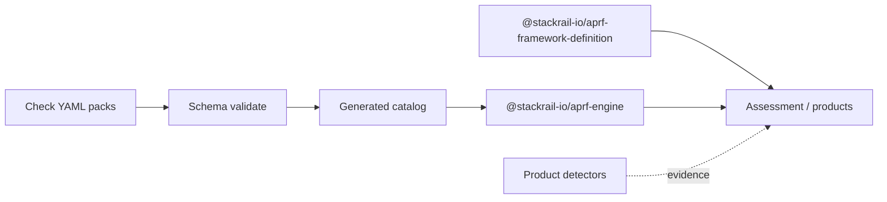

# AI Production Readiness Framework (APRF)

**Status:** working-draft **v0.10.0**  
**Publisher:** [StackRail](https://stackrail.io) (working-draft publisher)  
**Site:** [https://stackrail.io/aprf/](https://stackrail.io/aprf/)  
**Question:** Can this AI application safely operate in production?

APRF is a vendor-neutral working draft for engineering readiness of AI systems. It uses **gated pass/fail** mandatory checks — not a vanity readiness percentage. Self-assessment is **not** third-party certification.

## Architecture

Three planes (hardened after adversarial review):

| Plane | Contents | In this repo? |
| --- | --- | --- |
| **Normative** | Pillars → Checks (Requirement labels optional); profiles/lenses | Yes |
| **Binding** | Criticality, maturity floor, profile scope, N/A | Assessment-time |
| **Operational** | Evidence (tiered), Detections, engine roles | **No** — plugins / products |

Gates stay binary (no org-wide readiness %). Platform names belong in Detections, not Checks. See **[ARCHITECTURE.md](ARCHITECTURE.md)** and the critique trail **[ARCHITECTURE-REVIEW.md](ARCHITECTURE-REVIEW.md)**.



## This repository

This is the **normative public home** for APRF releases (Layers 1–3 + governance):

| Path | Contents |
| --- | --- |
| [`packages/aprf-engine/`](packages/aprf-engine/) | Check YAML catalog, schema, loader/index/evaluate (`@stackrail-io/aprf-engine`) |
| [`packages/framework-definition/`](packages/framework-definition/) | Profiles, lenses, Policy (`@stackrail-io/aprf-framework-definition`) |
| [`ARCHITECTURE.md`](ARCHITECTURE.md) | Three-plane architecture and runtime component design |
| [`SECURITY.md`](SECURITY.md) / [`CONTRIBUTING.md`](CONTRIBUTING.md) | Vulnerability reporting and contribution guide |
| [`CODE_OF_CONDUCT.md`](CODE_OF_CONDUCT.md) / [`NOTICE`](NOTICE) | Community standards and Apache attribution notice |
| [`spec/aprf-spec.json`](spec/aprf-spec.json) | Published machine-readable catalog mirror |
| [`schemas/`](schemas/) | JSON Schemas for the spec document and self-attestation exports |
| [`.github/workflows/ci.yml`](.github/workflows/ci.yml) | CI: rule validation, catalog drift, unit tests, spec structure |
| [`rfcs/`](rfcs/) | RFC template and open/historical RFCs |
| [`CHANGELOG.md`](CHANGELOG.md) | SemVer history |

**Author Checks here** under `packages/aprf-engine/rules/`. Product repos consume these packages from the [@stackrail-io](https://www.npmjs.com/org/stackrail-io) npm org (or a local `file:` / workspace link) — they must not redefine Check IDs.

```bash
npm install @stackrail-io/aprf-engine @stackrail-io/aprf-framework-definition
```

### Packages at a glance

| Package | Role |
| --- | --- |
| `@stackrail-io/aprf-engine` | YAML Checks as the source of truth; JSON Schema; load/index/evaluate helpers; generated TypeScript catalog |
| `@stackrail-io/aprf-framework-definition` | Core (40) / Regulated (61) profiles, lenses (RAG/Agents/Voice/Coding), Policy overlays, Check applicability |

Today the catalog holds **177 Checks** across **27 categories** (pillars). New Checks are data files — no engine code changes required.

## Quick start

Requires **Node.js 22+**.

```bash
npm install
npm run validate
```

`npm run validate` runs:

1. **`aprf:validate`** — load every YAML Check, validate against [`rule.schema.json`](packages/aprf-engine/rules/_schema/rule.schema.json), check referential integrity (`relatedRules`, unique IDs, detector allowlist)
2. **`aprf:catalog`** — regenerate [`packages/aprf-engine/src/generated/catalog.ts`](packages/aprf-engine/src/generated/catalog.ts) (content-hash stamped)
3. **`aprf:integrity`** — YAML catalog Check IDs must match `spec/aprf-spec.json`; Core/Regulated profile IDs and lenses must match `@stackrail-io/aprf-framework-definition` and exist in the catalog; stewardship `emailHint` must include the interim contact; no retired personal emails or product API paths in the published spec
4. **`test:unit`** — aprf-engine + framework-definition self-tests

Useful individual scripts:

```bash
npm run aprf:validate          # YAML schema + referential integrity
npm run aprf:catalog           # rebuild generated catalog (commit if changed)
npm run aprf:integrity         # YAML ↔ spec ↔ profile gate
npm run test:unit              # profile / policy unit tests
npm run build                  # emit publishable dist/ for both packages
```

**Framework SemVer** (e.g. v0.10.0) versions the catalog and gate semantics. **Schema path versions** (e.g. [spec-schema/0.7](https://stackrail.io/aprf/spec-schema/0.7)) version document *shape* independently — do not equate them.

## Check (rule) model

Each Check lives as one YAML file under `packages/aprf-engine/rules/by-category/<category>/<ID>.yaml` and must include:

| Field | Purpose |
| --- | --- |
| `id` | Stable Check ID (`SEC-M1`, `AUTHN-M1`, …) — never reuse |
| `category` | Pillar / category slug |
| `title`, `description`, `whyItMatters` | Human-facing normative prose |
| `severity` | `critical` \| `high` \| `medium` \| `low` (remediation ordering) |
| `weight` | Used for recommended scoring only — never the gate |
| `gate` | `mandatory` \| `recommended` |
| `passCondition` | Measurable pass criteria |
| `evidenceRequired` | Artifacts expected |
| `detection` | `capability` + optional detector refs (product-side) |
| `manualVerification` | How to verify when automation is partial/absent |
| `falsePositiveGuidance` | Triage guidance |
| `recommendedFixes` | Remediation hints |
| `references` | External standards / docs |
| `relatedRules` | Other Check IDs |
| `tags` | Search / filter labels |
| `applicability` | `minCriticality`, `requiredFromLevel`, optional `technologies`, profiles, lenses |
| `status` | `active` \| `deprecated` \| `draft` |

### Supported technologies (applicability)

Checks may declare zero or more of:

`github`, `terraform`, `docker`, `kubernetes`, `github-actions`, `azure-devops`, `aws`, `gcp`, `azure`, `prompt-templates`, `rag-pipelines`, `vector-databases`, `mcp`, `a2a`, `openapi`, `cicd`

Platform-specific **detections** (scanners, collectors) stay in product/plugin repos and map evidence back to these Check IDs.

### Add a Check without code changes

1. Create `packages/aprf-engine/rules/by-category/<category>/<NEW-ID>.yaml` matching an existing Check for shape.
2. Ensure `id` is unique and follows the published namespace (`PREFIX-M#` / `PREFIX-R#`).
3. Point `relatedRules` only at existing IDs; set `applicability` and `detection.capability` honestly.
4. Run `npm run validate` locally.
5. If the generated catalog changed, commit `packages/aprf-engine/src/generated/catalog.ts`.
6. Open a PR — CI will re-validate and fail on catalog drift.

Deprecate with `status: deprecated`, `replacedBy`, and `deprecationNote` — never reuse IDs. Numbering gaps are intentional — see [`packages/aprf-engine/rules/_index/id-gaps.md`](packages/aprf-engine/rules/_index/id-gaps.md).

## Continuous integration

[`.github/workflows/ci.yml`](.github/workflows/ci.yml) runs on every push to `main` and on pull requests:

| Job | What it checks |
| --- | --- |
| **Validate catalog and packages** | `npm ci` → rule schema/integrity → catalog rebuild → **fail if generated catalog drifted** → YAML↔spec↔profile integrity → unit tests → TypeScript `dist/` build |
| **Spec JSON structure** | `spec/aprf-spec.json` SemVer + pillar presence; schema `$id`s parse; stewardship `emailHint` present; no retired personal emails / product API paths |

PRs that edit YAML Checks but forget to regenerate the catalog will fail CI with a clear drift error. Fix with:

```bash
npm run aprf:catalog
git add packages/aprf-engine/src/generated/catalog.ts
```

## Profiles and assessment

| Profile | Mandatory Checks | Target |
| --- | --- | --- |
| **Core** (`aprf-profile-core`) | 40 | Tier 2 / capability level 3 |
| **Regulated** (`aprf-profile-regulated`) | 61 (Core + 21 Tier-3-only) | Tier 3 / capability level 5 |

Lenses (RAG, Agents, Voice, Coding) add additional mandatory Check IDs. Gating is binary: all in-scope mandatories must **pass** or be formally **N/A** with rationale.

The StackRail site hosts human-readable pillar pages, How APRF works, and the reference [Core / Regulated assessment](https://stackrail.io/aprf/assess/).

## Quick links

- Overview: https://stackrail.io/aprf/
- How it works: https://stackrail.io/aprf/how/
- Spec JSON (site mirror): https://stackrail.io/aprf/spec/
- Stewardship & RFCs: https://stackrail.io/aprf/rfc/
- Assess: https://stackrail.io/aprf/assess/
- Architecture: [ARCHITECTURE.md](ARCHITECTURE.md)
- Engine package: [packages/aprf-engine/README.md](packages/aprf-engine/README.md)
- Framework definition: [packages/framework-definition/README.md](packages/framework-definition/README.md)

## Contributing

1. Read [`CONTRIBUTING.md`](CONTRIBUTING.md), [`ARCHITECTURE.md`](ARCHITECTURE.md), and [`rfcs/0000-template.md`](rfcs/0000-template.md).
2. For Check / profile / schema changes: edit YAML or packages here, run `npm run validate`, open a PR.
3. For process or layering changes: open an issue or PR against this repository, or follow [/aprf/rfc/](https://stackrail.io/aprf/rfc/).
4. Security reports: see [`SECURITY.md`](SECURITY.md). Conduct: [`CODE_OF_CONDUCT.md`](CODE_OF_CONDUCT.md).
5. Interim contact: `anu.v.apps@gmail.com` (also in `spec/aprf-spec.json` stewardship contact; transfers with steward).

## License

Copyright © StackRail contributors. Licensed under the [Apache License 2.0](LICENSE).
