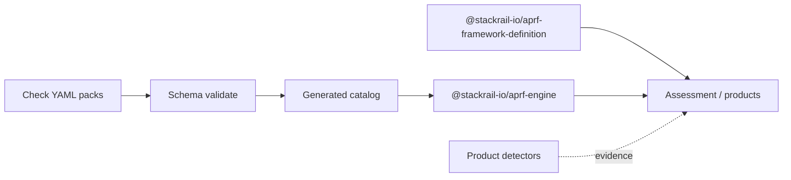

<p align="center">
  <a href="https://github.com/stackrail-io/APRF">
    
  </a>
</p>

<h1 align="center">AI Production Readiness Framework (APRF)</h1>

<p align="center">
  <strong>Can this AI application safely operate in production?</strong>
</p>

<p align="center">
  <a href="https://github.com/stackrail-io/APRF/actions/workflows/ci.yml"></a>
  <a href="https://www.npmjs.com/package/@stackrail-io/aprf"></a>
  <a href="LICENSE"></a>
  <a href="https://stackrail.io/aprf/"></a>
  <a href="https://stackrail.io"></a>
</p>

APRF is a vendor-neutral working draft for engineering readiness of AI systems. It uses **gated pass/fail** mandatory checks — not a vanity readiness percentage. Self-assessment is **not** third-party certification.

**Site:** [https://stackrail.io/aprf/](https://stackrail.io/aprf/)

## Architecture

Three planes (hardened after adversarial review):

| Plane | Contents | In this repo? |
| --- | --- | --- |
| **Normative** | Pillars → Checks (Requirement labels optional); profiles/lenses; informative crosswalks/threat map | Yes |
| **Binding** | Criticality, maturity floor, profile scope, N/A | Assessment-time |
| **Operational** | Evidence collection, Detections, engine roles | **Yes (reference):** repo collectors + CLI assess/report; products may ship their own stores/detectors/UIs |

Gates stay binary (no org-wide readiness %). Platform names belong in Detections, not Checks. See **[ARCHITECTURE.md](ARCHITECTURE.md)** and the critique trail **[ARCHITECTURE-REVIEW.md](ARCHITECTURE-REVIEW.md)**.



## This repository

This is the **normative public home** for APRF (three planes + governance), plus the open local assessment CLI and auditor skill:

| Path | Contents |
| --- | --- |
| [`packages/aprf-engine/`](packages/aprf-engine/) | Check YAML catalog, schema, generated catalog (incl. crosswalks + threat intel), index/evaluate (`@stackrail-io/aprf-engine`) |
| [`packages/framework-definition/`](packages/framework-definition/) | Profiles, lenses, Policy (`@stackrail-io/aprf-framework-definition`) |
| [`packages/aprf/`](packages/aprf/) | Local CLI: collect → assess → `REPORT.html` (`@stackrail-io/aprf`) |
| [`ARCHITECTURE.md`](ARCHITECTURE.md) | Three-plane architecture, threat context, and shipped assessment path |
| [`SECURITY.md`](SECURITY.md) / [`CONTRIBUTING.md`](CONTRIBUTING.md) | Vulnerability reporting and contribution guide |
| [`CODE_OF_CONDUCT.md`](CODE_OF_CONDUCT.md) / [`NOTICE`](NOTICE) | Community standards and Apache attribution notice |
| [`spec/aprf-spec.json`](spec/aprf-spec.json) | Published machine-readable catalog mirror (incl. `rfcs` + `stats`) |
| [`spec/aprf-threat-map.yaml`](spec/aprf-threat-map.yaml) | Per-Check threat context (informative; MITRE optional) |
| [`spec/mitre-technique-index.json`](spec/mitre-technique-index.json) | Pinned MITRE ATLAS / ATT&CK technique IDs for offline validation |
| [`schemas/`](schemas/) | JSON Schemas for the spec document and self-attestation exports |
| [`.github/workflows/ci.yml`](.github/workflows/ci.yml) | CI: rules, catalog drift, integrity, threat-map, collectors, tests, build |
| [`rfcs/`](rfcs/) | RFC template and open/historical RFCs (`npm run aprf:sync-rfcs`) |
| [`skills/aprf-auditor/`](skills/aprf-auditor/) | Portable **APRF Auditor** skill + collectors — local assessment without StackRail backend |
| [`plugins/aprf/`](plugins/aprf/) | **Cursor plugin** — wraps `@stackrail-io/aprf` CLI (`/aprf-audit`); Team Marketplace via [`.cursor-plugin/marketplace.json`](.cursor-plugin/marketplace.json) |
| [`CHANGELOG.md`](CHANGELOG.md) | SemVer history |

**Author Checks here** under `packages/aprf-engine/rules/`. Product repos consume these packages from the [@stackrail-io](https://www.npmjs.com/org/stackrail-io) npm org (or a local `file:` / workspace link) — they must not redefine Check IDs.

```bash
npm install @stackrail-io/aprf-engine @stackrail-io/aprf-framework-definition
# Optional CLI (collect → assess v0 → REPORT.html):
npx @stackrail-io/aprf audit --target . --profile core
```

### Packages at a glance

| Package | Role |
| --- | --- |
| `@stackrail-io/aprf-engine` | YAML Checks as the source of truth; JSON Schema; generated TypeScript catalog (Checks + crosswalks + threat intel); index/evaluate helpers |
| `@stackrail-io/aprf-framework-definition` | Core / Regulated profiles, lenses (RAG/Agents/Voice/Coding), Policy overlays, Check applicability |
| `@stackrail-io/aprf` | CLI: `collect` / `assess` / `report` / `audit` — pinned catalog, no repo clone |

Today the catalog holds **178 Checks** across **27 pillars** (**92** mandatory / **85** recommended active, plus **1** deprecated recommended stub `INF-R1`). New Checks are data files — no engine code changes required — but each Check needs a row in [`spec/aprf-threat-map.yaml`](spec/aprf-threat-map.yaml).

## Quick start

Requires **Node.js 22+**.

```bash
npm install
npm run validate
```

`npm run validate` runs:

1. **`aprf:validate`** — load every YAML Check, validate against [`rule.schema.json`](packages/aprf-engine/rules/_schema/rule.schema.json), check referential integrity (`relatedRules`, unique IDs, detector allowlist)
2. **`aprf:catalog`** — regenerate [`packages/aprf-engine/src/generated/catalog.ts`](packages/aprf-engine/src/generated/catalog.ts) (content-hash stamped; embeds crosswalks + threat intel)
3. **`aprf:integrity`** — YAML ↔ `spec/aprf-spec.json` Check IDs; Core/Regulated + lenses match framework-definition; `stats` match recomputed values; stewardship contact hygiene
4. **`aprf:detector-bridge`** — every Check detector (except `manual-attest`) claimed in `plugin.detectorIds`; generated join maps in sync
5. **`aprf:check-spec-sync`** — run `aprf:sync-rfcs` + `aprf:sync-stats` + `aprf:sync-evidence-tiers`; **fail if** `spec/aprf-spec.json` drifts
6. **`aprf:threat-map`** — every Check has threat context; closed vocabularies; pinned MITRE IDs
7. **`aprf:collectors:unused`** — TypeScript unused locals/parameters in auditor collectors
8. **`test:unit`** — aprf-engine + framework-definition + CLI smoke
9. **`test:auditor-skill`** — auditor skill / collector / HTML report smokes

Useful individual scripts:

```bash
npm run aprf:validate          # YAML schema + referential integrity
npm run aprf:catalog           # rebuild generated catalog (commit if changed)
npm run aprf:integrity         # YAML ↔ spec ↔ profile ↔ stats gate
npm run aprf:detector-bridge   # Check detectors ↔ plugin.detectorIds + join maps
npm run aprf:sync-rfcs         # rfcs/*.md → spec/aprf-spec.json `rfcs`
npm run aprf:sync-stats        # recompute spec/aprf-spec.json `stats`
npm run aprf:sync-evidence-tiers  # project Check minimumTier onto spec check rows
npm run aprf:check-spec-sync   # sync rfcs+stats+evidence-tiers; fail on drift (CI + validate)
npm run aprf:threat-map        # threat-map coverage + MITRE IDs
npm run test:unit              # engine / framework / CLI unit + smoke
npm run build                  # emit publishable dist/ for all packages
```

**Framework SemVer** (e.g. v0.11.0) versions the catalog and gate semantics. **Schema path versions** (e.g. [spec-schema/0.7](https://stackrail.io/aprf/spec-schema/0.7)) version document *shape* independently — do not equate them.

## Check (rule) model

Taxonomy matches [APRF domains & pillars](https://stackrail.io/aprf/): **domain** → **pillar** (APRF-NN) → **Check**. Indexes live under `packages/aprf-engine/rules/_index/` (`domains.yaml`, `pillars.yaml`). Each Check is one YAML file under `packages/aprf-engine/rules/by-domain/<domain>/<pillar-slug>/<ID>.yaml` and must include:

| Field | Purpose |
| --- | --- |
| `id` | Stable Check ID (`SEC-M1`, `AUTHN-M1`, …) — never reuse |
| `category` | Pillar slug (e.g. `ai-security`, `authentication`) — same as site URL path |
| `title`, `description`, `whyItMatters` | Human-facing normative prose |
| `severity` | `critical` \| `high` \| `medium` \| `low` (remediation ordering) |
| `weight` | Used for recommended scoring only — never the gate |
| `gate` | `mandatory` \| `recommended` |
| `passCondition` | Measurable pass criteria |
| `evidenceRequired` | Artifacts expected |
| `detection` | `capability` + optional detector refs (product-side) |
| `manualVerification` | How to verify when automation is partial/absent |
| `falsePositiveGuidance` | Triage guidance |
| `recommendedFixes` | Remediation hints |
| `references` | External standards / docs |
| `relatedRules` | Other Check IDs |
| `tags` | Search / filter labels |
| `applicability` | `minCriticality`, `requiredFromLevel`, optional `technologies`, profiles, lenses |
| `status` | `active` \| `deprecated` \| `draft` |

### Supported technologies (applicability)

Checks may declare zero or more of:

`github`, `terraform`, `docker`, `kubernetes`, `github-actions`, `azure-devops`, `aws`, `gcp`, `azure`, `prompt-templates`, `rag-pipelines`, `vector-databases`, `mcp`, `a2a`, `openapi`, `cicd`

Platform-specific **detections** (scanners, collectors) stay in product/plugin repos and map evidence back to these Check IDs.

### Add a Check without code changes

1. Create `packages/aprf-engine/rules/by-domain/<domain>/<pillar-slug>/<NEW-ID>.yaml` matching an existing Check for shape.
2. Ensure `id` is unique and follows the published namespace (`PREFIX-M#` / `PREFIX-R#`).
3. Point `relatedRules` only at existing IDs; set `applicability` and `detection.capability` honestly.
4. Add a matching entry under [`spec/aprf-threat-map.yaml`](spec/aprf-threat-map.yaml) (required; MITRE mapping optional and must not be forced).
5. Run `npm run validate` locally (includes `aprf:threat-map`).
6. If the generated catalog changed, commit `packages/aprf-engine/src/generated/catalog.ts`.
7. Open a PR — CI will re-validate and fail on catalog or threat-map drift.

Deprecate with `status: deprecated`, `replacedBy`, and `deprecationNote` — never reuse IDs. Numbering gaps are intentional — see [`packages/aprf-engine/rules/_index/id-gaps.md`](packages/aprf-engine/rules/_index/id-gaps.md). **Pre-release exception:** before the first tagged version, M→R remaps may remove IDs when an RFC and `id-gaps.md` record the change (see [APRF-RFC-0002](rfcs/0002-incident-readiness-mandatory-to-recommended.md)).

## Continuous integration

[`.github/workflows/ci.yml`](.github/workflows/ci.yml) runs on every push to `main` and on pull requests:

| Job | What it checks |
| --- | --- |
| **Validate catalog and packages** | `npm ci` → rule schema → catalog rebuild → **fail if generated catalog drifted** → YAML↔spec↔profile↔stats integrity → **sync-rfcs + sync-stats + sync-evidence-tiers; fail if `aprf-spec.json` drifted** → threat-map → collectors unused → unit tests → auditor-skill tests → TypeScript `dist/` build |
| **Spec JSON structure** | `spec/aprf-spec.json` SemVer + pillar presence; schema `$id`s parse; stewardship `emailHint` present; no retired personal emails / product API paths |

PRs that edit YAML Checks but forget to regenerate the catalog will fail CI with a clear drift error. Fix with:

```bash
npm run aprf:catalog
git add packages/aprf-engine/src/generated/catalog.ts
```

## Profiles and assessment

| Profile | Mandatory Checks | Target |
| --- | --- | --- |
| **Core** (`aprf-profile-core`) | 39 | Tier 2 / capability level 3 |
| **Regulated** (`aprf-profile-regulated`) | 51 (Core + 12 Tier-3-only) | Tier 3 / capability level 5 |

Lenses (RAG, Agents, Voice, Coding) add additional mandatory Check IDs. Gating is binary: all in-scope mandatories must **pass** or be formally **N/A** with rationale. Assessments also carry **informative** peer-framework crosswalks (NIST AI RMF, ISO/IEC 42001, OWASP LLM Top 10 with AISVS bridges, AISVS, ASVS, OpenCRE, CSA MAESTRO, FIASSE/SSEM, SOC 2, AWS Well-Architected, SLSA) and threat context (including a “Top threat exposure” rollup in `REPORT.html`) — these never change the gate.

### Local agent assessment (APRF Auditor skill)

**Cursor (recommended):** install the plugin from [`plugins/aprf/`](plugins/aprf/) (local link or Team Marketplace), then `@aprf-auditor` / `/aprf-audit` → `npx @stackrail-io/aprf audit`.

**Other hosts:** load [`skills/aprf-auditor/`](skills/aprf-auditor/) in Claude Code, Codex, Copilot Agent, or any MCP-compatible host. Phrases like **“Run an APRF assessment”** activate it. See the skill [README](skills/aprf-auditor/README.md).

The StackRail site hosts human-readable pillar pages, How APRF works, and the reference [Core / Regulated assessment](https://stackrail.io/aprf/assess/).

## Quick links

- Overview: https://stackrail.io/aprf/
- How it works: https://stackrail.io/aprf/how/
- Spec JSON (site mirror): https://stackrail.io/aprf/spec/
- Stewardship & RFCs: https://stackrail.io/aprf/rfc/
- Assess: https://stackrail.io/aprf/assess/
- Architecture: [ARCHITECTURE.md](ARCHITECTURE.md)
- Engine package: [packages/aprf-engine/README.md](packages/aprf-engine/README.md)
- Framework definition: [packages/framework-definition/README.md](packages/framework-definition/README.md)

## Contributing

1. Read [`CONTRIBUTING.md`](CONTRIBUTING.md), [`ARCHITECTURE.md`](ARCHITECTURE.md), and [`rfcs/0000-template.md`](rfcs/0000-template.md).
2. For Check / profile / schema changes: edit YAML or packages here, run `npm run validate`, open a PR.
3. For process or layering changes: open an issue or PR against this repository, or follow [/aprf/rfc/](https://stackrail.io/aprf/rfc/).
4. Security reports: see [`SECURITY.md`](SECURITY.md). Conduct: [`CODE_OF_CONDUCT.md`](CODE_OF_CONDUCT.md).
5. Interim contact: `anu.v.apps@gmail.com` (also in `spec/aprf-spec.json` stewardship contact; transfers with steward).

## License

Copyright © StackRail contributors. Licensed under the [Apache License 2.0](LICENSE).
