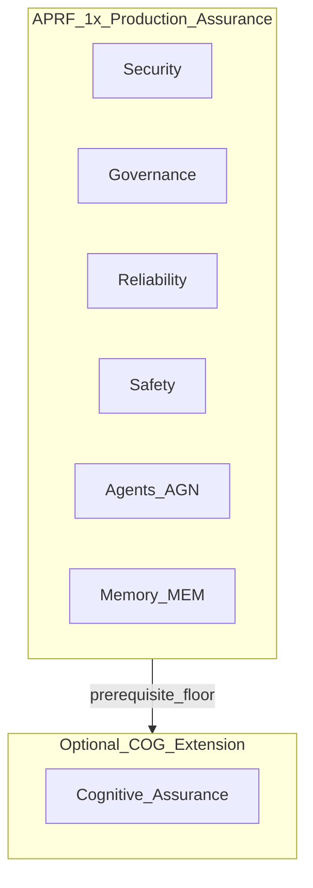
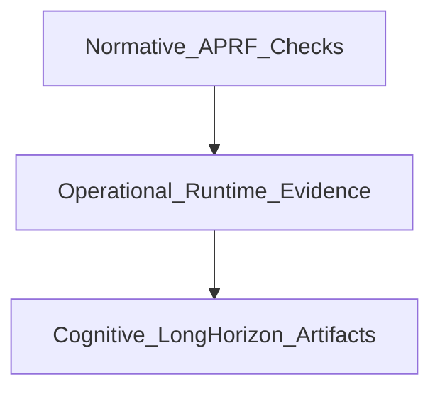

# APRF-RFC-0012: Cognitive Assurance Experimental Extension (COG)

| Field | Value |
| --- | --- |
| Status | draft |
| Author(s) | StackRail |
| Created | 2026-08-16 |
| SemVer impact | MINOR |
| Index summary | Proposes an optional future Cognitive Assurance (COG) Experimental Extension for long-lived persistent autonomous agents—objective governance, memory lineage, policy evolution, decision provenance, and behavioral continuity—without changing APRF 1.x Core/Regulated philosophy or Checks. |

## Problem

APRF 1.x evaluates **production readiness of the application stack**: evidence → Checks → pass/fail across Security, Reliability, Observability, Data, Agents, Governance, Evaluation, and Safety. That answers: *Is this system safe, governed, observable, and operable to ship?*

Industry systems are beginning to add a second object of assurance: the **long-lived agent runtime itself**—durable objectives, evolving standing policies, memory lineage, and behavioral continuity across weeks or months. Existing pillars cover deploy-time agency (AGN), durable-memory safety (MEM), human approval (HUM), observability (OBS), and evaluation (EVL), but they do not yet define measurable long-horizon continuity controls.

Without a named optional extension:

- Assessors invent ad-hoc “agent psychology” language that is not auditable.
- Product teams conflate short-lived copilots with persistent autonomous systems.
- Future catalog pressure risks stuffing long-horizon requirements into Core AGN/MEM and diluting APRF’s production-readiness signal.

This RFC defines **Cognitive Assurance** as an engineering discipline—not AGI, consciousness, or psychology—so a future APRF 2.x/3.x Experimental Extension can ship without weakening Security, Governance, Reliability, or Safety.

**Definition:** Cognitive Assurance is the discipline of governing the **long-term behavior, memory, objectives, and decision continuity** of persistent autonomous AI systems.

## Proposal

### Normative intent (this RFC)

1. Accept **COG** as a **future Experimental Extension** (draft roadmap), not a Core or Regulated requirement in APRF 1.x.
2. Record pillar purpose, applicability, thirteen proposed Checks, related-rule crosswalk, assurance-layer integration, and adoption path.
3. **Do not** ship YAML Checks, profile JSON, collectors, evidence-type registry entries, or scoring changes in the same change set as this draft RFC.

When this RFC is later **accepted** and implemented, SemVer impact is **MINOR** (new optional profile/lens + Checks; Core/Regulated unchanged).

### Separation from existing domains

| Domain | What it assures | What it does not cover for long-lived agents |
| --- | --- | --- |
| **Security** | AuthN/Z, secrets, attack surface, tool egress | Whether the agent’s *approved objectives* drifted after deploy |
| **Governance** | Inventory, RACI, change control, compliance artifacts | Continuous *identity continuity* and *objective versioning* of one agent instance over time |
| **Reliability** | SLOs, failover, capacity, chaos | Whether multi-month *behavior* remains within declared envelopes |
| **Safety** | Harm refusal, output filters, kill switches | Whether *goal/policy self-updates* were approved and attributable |
| **Agents (AGN)** | Charter, loop/tool bounds, autonomy at deploy | Months-long objective governance, reflection history, behavioral regression |
| **Memory (MEM)** | Poisoning, retention, tenant isolation, write policy | Memory *provenance chains*, expiration tied to objective epochs, integrity of agent identity state over time |

**Non-weakening / additive rule:** COG never replaces AGN, MEM, SEC, GOV, REL, SAF, HUM, OBS, EVL, TOL, or CHG. A system that fails Security (or any Core Critical) still fails APRF; COG cannot compensate. Related Checks use `relatedRules` (see crosswalk below).

### Scope

#### Systems that require Cognitive Assurance (when the extension is adopted)

Apply COG when **all** of the following hold:

1. **Persistence:** Agent state (objectives, policies, and/or durable memory) survives across sessions for a declared horizon (proposed default: continuous operation or state retention **≥ 30 days**).
2. **Autonomy:** The system can plan/act with tools or side effects without a human in every loop (same production-agent sense as AGN-M1).
3. **Adaptive control surface:** The system can change **objectives**, **standing policies**, or **durable behavioral configuration** after initial deploy (human-approved or autonomous learning), not only per-request prompts.
4. **Identity:** There is a stable production agent identity whose behavior is expected to remain coherent over time (versioned agent instance, not one-shot jobs).

Examples: long-lived enterprise agents with durable memory and policy updates; multi-month assistants with standing goals; autonomous ops agents that revise runbooks/policies under change control.

#### Systems that do not require COG

- Request/response LLM features without durable agent identity
- Short-lived agents (session or job scoped; no long-horizon objectives)
- RAG / knowledge bases without agent objective/policy evolution
- Batch inference, offline training jobs, model hosting alone
- Agent frameworks/SDKs in isolation (same AGN rule)
- Systems whose only “memory” is ephemeral context windows

**Applicability gate (assessment):** If any of (1)–(3) is false → all COG Checks score `NOT_APPLICABLE`. Core APRF still applies. Criterion (4) clarifies identity continuity expectations when (1)–(3) hold.

### Proposed pillar

| Field | Value |
| --- | --- |
| **ID** | `COG` |
| **Name** | Cognitive Assurance |
| **Domain (proposed)** | `cognitive-assurance` (experimental; not in Core domains until APRF 3.x) |
| **Purpose** | Assure that persistent autonomous AI systems maintain auditable control over long-term objectives, memory lineage, policy evolution, decision provenance, identity continuity, and behavioral consistency. |
| **Scope** | Durable objectives, goal/policy change governance, reflection/decision artifacts, memory provenance and integrity over time, identity continuity, behavior drift and long-horizon regression, autonomous learning approval, self-modification bounds. |
| **Applicability** | Production agents meeting the four criteria above. |
| **Non-applicability** | Ephemeral, non-adaptive, or non-agent AI surfaces listed above. |
| **Profile placement** | **Not** Core or Regulated. Ship as Experimental Extension via e.g. `aprf-profile-persistent-agent` (2.x) and/or `aprf-lens-cognitive` (3.x). |
| **Philosophy constraint** | Does not alter APRF’s evidence-first, Check-based, framework-neutral stance. No consciousness, psychology, or AGI claims. Prefer engineering language: persistent objectives, behavioral consistency, policy evolution, decision provenance, memory governance, identity continuity. |

### Proposed Checks (13)

Check shape follows [`packages/aprf-engine/rules/_schema/rule.schema.json`](../packages/aprf-engine/rules/_schema/rule.schema.json). Implementation (later) under e.g. `rules/by-domain/cognitive-assurance/cognitive-assurance/`. Gates below are **within the COG profile/lens only**—they are not Core mandatories.

#### COG-M1 — Persistent objectives are declared, versioned, and owned

- **Description:** Every applicable agent shall maintain a version-controlled **persistent objectives** record (standing goals/constraints) with owner, version, effective dates, and linkage to the AGN charter.
- **Why it matters:** Undeclared standing goals become unreviewable long-horizon behavior.
- **Severity:** critical | **gate:** mandatory (COG profile only)
- **Evidence:** Objectives document/registry; charter link; approval metadata; `measuredAt ≤ 90d`
- **Detection:** hybrid (repo inventory + runtime config consistency)
- **False positives:** Per-request task prompts mistaken for persistent objectives; documenting only ephemeral intents
- **Recommended fixes:** Publish objectives registry; bind runtime to approved version; deny boot if missing
- **relatedRules:** `AGN-M1`, `ORG-R2`

#### COG-M2 — Goal and objective changes require recorded approval

- **Description:** Changes to persistent objectives shall require structured approval (approver, rationale, before/after version) before becoming effective in production.
- **Why it matters:** Silent goal mutation is unattributable long-term risk.
- **Severity:** critical | **gate:** mandatory
- **Evidence:** Change tickets / signed objective diffs; enforcement that rejects unapproved versions
- **Detection:** hybrid
- **False positives:** Non-production sandbox agents; A/B of ephemeral prompts
- **Recommended fixes:** Gate objective activation behind approval API; immutable audit log
- **relatedRules:** `AGN-M1`, `HUM-M1`, `HUM-M2`, `CHG-M1`, `CMP-M3`, `ORG-R4`

#### COG-M3 — Policy evolution is append-only and attributable

- **Description:** Standing behavioral/policy configuration updates shall be append-only (or equivalently versioned with immutable history), each entry attributed to actor (human or system), timestamp, and approval reference.
- **Why it matters:** Overwritten policies erase forensic continuity.
- **Severity:** high | **gate:** mandatory
- **Evidence:** Policy version store; attribution fields; integrity hashes
- **Detection:** hybrid
- **False positives:** Stateless prompt templates redeployed as “new policy” without a durable store
- **Recommended fixes:** Policy ledger; prohibit in-place overwrite of production policy blobs
- **relatedRules:** `CHG-M1`, `CMP-M3`, `ORG-M1`, `SAF-M1`

#### COG-M4 — Decision provenance is retained for consequential actions

- **Description:** For actions above a declared impact threshold (tools with side effects, spend, data mutation), the system shall retain decision provenance: objective version, policy version, inputs summary hash, tool calls, and outcome reference, for a declared retention period.
- **Why it matters:** Without provenance, multi-month incidents cannot be reconstructed.
- **Severity:** high | **gate:** mandatory
- **Evidence:** Provenance store schema + sample records + retention policy
- **Detection:** hybrid
- **False positives:** Requiring every token of chain-of-thought (not required—structured provenance is)
- **Recommended fixes:** Emit provenance events at tool boundary; bind to agent identity
- **relatedRules:** `OBS-M1`, `OBS-R1`, `TOL-M1`, `TOL-M2`, `TOL-M3`, `HUM-M2`, `AGN-M2`

#### COG-M5 — Memory provenance and lineage are recorded

- **Description:** Durable memory writes shall carry provenance (writer identity, source type, objective/policy epoch, write time) queryable for audit.
- **Why it matters:** MEM write policy alone does not explain *why* a memory exists months later.
- **Severity:** high | **gate:** mandatory
- **Evidence:** Memory schema with provenance fields; query/demo; deny writes missing provenance
- **Detection:** hybrid
- **False positives:** Session caches labeled as durable memory
- **Recommended fixes:** Enforce provenance on write path
- **relatedRules:** `MEM-M3`, `MEM-M1`, `MEM-R3`

#### COG-M6 — Memory expiration aligns with objective and policy epochs

- **Description:** Durable memories shall have TTL or epoch invalidation rules tied to objective/policy versions so superseded epochs do not silently drive behavior.
- **Why it matters:** Stale memories under new objectives cause uncontrolled drift.
- **Severity:** high | **gate:** mandatory
- **Evidence:** Expiration/epoch policy; enforcement tests; purge/reindex jobs
- **Detection:** hybrid
- **False positives:** Legal-hold archives exempted with documented compensating control
- **Recommended fixes:** Epoch tags; revalidation on objective bump
- **relatedRules:** `MEM-M2`, `MEM-R3`

#### COG-M7 — Memory integrity and tamper evidence

- **Description:** Durable agent memory and objective/policy stores shall support integrity verification that detects unauthorized mutation via a cryptographic MAC or signature with protected key material, or an independently protected immutable anchor (for example WORM / append-only ledger with write-once semantics). Bare checksums alone are acceptable only for accidental-corruption detection, not as sole evidence of tamper resistance.
- **Why it matters:** Silent corruption or rewrite breaks continuity assurance; an attacker who can rewrite the store can recompute an unkeyed checksum.
- **Severity:** high | **gate:** mandatory
- **Evidence:** Integrity mechanism config showing MAC/signature (or immutable anchor); key-protection or anchor-protection evidence; tamper-detection test results that fail on unauthorized mutation
- **Detection:** hybrid
- **False positives:** Read-replica lag mistaken for integrity failure; checksum-only health checks used for corruption monitoring (allowed as a supplement, not as the COG-M7 control)
- **Recommended fixes:** Sign or MAC memory/continuity entries with keys outside the writable store; or place critical state in an independently protected immutable anchor; keep bare checksums only as secondary corruption detectors
- **relatedRules:** `MEM-M4`, `SEC-M1`

#### COG-M8 — Agent identity continuity is defined and verified

- **Description:** Each long-lived agent shall have a stable production identity, version lineage, and continuity checks (config, objectives, memory namespace binding) so “same agent” is auditable across deploys.
- **Why it matters:** Identity swap or silent fork defeats longitudinal governance.
- **Severity:** high | **gate:** mandatory
- **Evidence:** Identity registry; deployment binding tests; namespace isolation proof
- **Detection:** hybrid
- **False positives:** Blue/green new *version* with explicit lineage (allowed if versioned)
- **Recommended fixes:** Immutable `agent_id`; require lineage on replace
- **relatedRules:** `AGN-M1`, `MEM-M1`, `AGN-M4`

#### COG-R1 — Behavior drift monitoring against declared envelopes

- **Description:** Operators shall monitor quantitative behavioral envelopes (tool-use rates, refusal rates, objective-relevant KPIs) against baselines derived from approved objectives/policies, with alerting on sustained deviation.
- **Why it matters:** Gradual drift is invisible without longitudinal metrics.
- **Severity:** medium | **gate:** recommended (may become mandatory in a future Regulated-style COG profile)
- **Evidence:** Dashboards/alerts; baseline docs; incident examples or synthetic drift test
- **Detection:** hybrid
- **False positives:** Traffic seasonality without an envelope recalibration process
- **Recommended fixes:** Define envelopes; alert; require review ticket on breach
- **relatedRules:** `OBS-R3`, `EVL-M3`, `EVL-M2`, `ORG-R3`

#### COG-R2 — Long-horizon behavioral regression suite

- **Description:** Before promoting objective/policy changes, run a regression suite of representative long-horizon scenarios (multi-step, memory-dependent) with pass criteria tied to approved behavior.
- **Why it matters:** Unit tests of single turns miss continuity failures.
- **Severity:** medium | **gate:** recommended
- **Evidence:** Suite definition; CI/CD gates; last run `measuredAt ≤ 90d`
- **Detection:** automated
- **False positives:** Only golden prompt tests without memory/objective fixtures
- **Recommended fixes:** Scenario packs keyed to objective versions
- **relatedRules:** `EVL-M1`, `EVL-M2`, `EVL-R1`, `AGN-R2`, `MEM-R1`

#### COG-M9 — Autonomous learning / self-update requires approval boundary

- **Description:** Any capability that updates standing objectives, policies, or durable behavioral parameters from online learning shall be disabled by default and enabled only behind explicit approval scope (what may change, rate limits, rollback).
- **Why it matters:** Unbounded self-update is unconstrained long-term control-plane change.
- **Severity:** critical | **gate:** mandatory
- **Evidence:** Feature flags; approval records; deny-by-default tests
- **Detection:** hybrid
- **False positives:** Offline fine-tunes promoted via normal ML change control (covered by GOV/ML process—not COG online self-update)
- **Recommended fixes:** Separate “online policy write” permission; human approval gate
- **relatedRules:** `AGN-M2`, `HUM-M1`, `HUM-M3`, `CHG-R2`, `CHG-M2`, `ORG-R4`

#### COG-M10 — Self-modification governance (code, tools, privileges)

- **Description:** Agents shall not expand their own tool allowlists, privileges, or executable code in production without external change control equivalent to human-driven deploy policy.
- **Why it matters:** Self-escalation bypasses AGN charter bounds over time.
- **Severity:** critical | **gate:** mandatory
- **Evidence:** Enforcement that blocks self-grant; pentest or deny tests; charter consistency
- **Detection:** hybrid
- **False positives:** Agent proposing a PR that humans merge (allowed—human is the control)
- **Recommended fixes:** Immutable allowlists at runtime; privileged ops only via external CI
- **relatedRules:** `TOL-M2`, `TOL-M5`, `AGN-M1`, `AGN-M2`, `AGN-M3`, `SEC-M1`, `HUM-M3`

#### COG-R3 — Reflection / deliberation artifacts retained when used for control

- **Description:** If the system persists reflection or deliberation artifacts that later influence objectives, memory, or actions, those artifacts shall be retained as structured, redacted control summaries with provenance, access control, and bounded retention (not required if unused for control). Raw model chain-of-thought, full prompts, unrestricted tool payloads, or unredacted PII are not required and shall not be the default retained form.
- **Why it matters:** Hidden control inputs are unauditable; retaining raw reasoning creates an unbounded sensitive-data store.
- **Severity:** medium | **gate:** recommended
- **Evidence:** Artifact store schema for structured/redacted summaries; access-control config; bounded retention policy; linkage to decisions/objectives/memory; samples showing redaction
- **Detection:** hybrid
- **False positives:** Ephemeral chain-of-thought never written to durable store (`NOT_APPLICABLE`); raw CoT logs kept only in short-TTL debug sinks outside the control path
- **Recommended fixes:** Persist control-influencing reflections as governed, redacted summaries (align with COG-M5 / OBS-M2); enforce ACL and TTL; exclude raw CoT from the required retention set
- **relatedRules:** `COG-M5`, `MEM-M3`, `OBS-M1`, `OBS-M2`

### Related-rule crosswalk (non-weakening)

| COG Check | Primary existing Checks | Distinction (COG adds) |
| --- | --- | --- |
| COG-M1 | AGN-M1, ORG-R2 | Standing **objectives ledger** over months, not only charter at deploy |
| COG-M2 | HUM-M1/M2, CHG-M1, CMP-M3 | Approval of **objective version flips**, not only high-impact tool acts |
| COG-M3 | CHG-M1, CMP-M3, ORG-M1, SAF-M1 | Append-only **standing policy evolution** history |
| COG-M4 | OBS-M1, TOL-M*, HUM-M2, AGN-M2 | Provenance bound to **objective/policy versions** for consequential acts |
| COG-M5 | MEM-M3, MEM-M1, MEM-R3 | Provenance/lineage fields beyond write-policy deny tests |
| COG-M6 | MEM-M2, MEM-R3 | TTL/invalidation tied to **objective/policy epochs** |
| COG-M7 | MEM-M4, SEC-M1 | Authenticated integrity (MAC/signature or immutable anchor) of continuity stores |
| COG-M8 | AGN-M1, MEM-M1, AGN-M4 | Longitudinal **identity continuity** across deploys/namespaces |
| COG-R1 | OBS-R3, EVL-M2/M3, ORG-R3 | Drift vs **declared behavioral envelopes** from approved objectives |
| COG-R2 | EVL-M1/M2, EVL-R1, AGN-R2, MEM-R1 | Multi-step **memory-dependent** long-horizon regression |
| COG-M9 | AGN-M2, HUM-M1/M3, CHG-R2/M2 | Deny-by-default **online** objective/policy self-update |
| COG-M10 | TOL-M2/M5, AGN-M1/M2/M3, SEC-M1, HUM-M3 | Block **self-expansion** of tools/privileges/code in production |
| COG-R3 | MEM-M3, OBS-M1, OBS-M2 | Redacted control summaries only when reflection artifacts **influence control** |

**N/A rules:**

- If the system is not a production agent under AGN-M1 sense → COG `NOT_APPLICABLE`.
- If durable memory does not exist → COG-M5/M6/M7 may be `NOT_APPLICABLE` individually while other COG Checks still apply (objectives/policy-only agents).
- If no online learning/self-update surface exists → COG-M9 `NOT_APPLICABLE` (must still prove deny-by-default or absent capability).
- If reflection artifacts are never persisted for control → COG-R3 `NOT_APPLICABLE`.

### Integration with existing APRF

#### Assurance layers (additive)

1. **Normative** — Existing Core Checks (SEC, GOV, REL, SAF, AGN, MEM, …): *must the system exist in a governed, secure, reliable form?*
2. **Operational** — Collectors, evidence graph, evidence tiers ([APRF-RFC-0011](0011-evidence-assurance-tiers.md)): *can we prove runtime posture now?*
3. **Cognitive** — Long-horizon artifacts (objective ledgers, policy history, provenance, drift): *does the persistent agent remain within declared continuity bounds over time?*

COG consumes (3) and **presupposes** (1)+(2). No COG PASS if Core Criticals fail.

#### Why optional / not Core

- Most production AI today is request-scoped or short-lived; COG would be perpetual `NOT_APPLICABLE` noise.
- Evidence types for month-scale provenance and drift are not industry-standard yet.
- Shipping COG in Core would dilute APRF’s production-readiness signal and imply maturity the ecosystem lacks.
- Extension via profile/lens preserves philosophy: measurable Checks, evidence-first, framework-neutral—**opt-in** when systems meet the scope criteria.

#### Roadmap

| Generation | Focus | COG role |
| --- | --- | --- |
| **APRF 1.x** | Production Assurance (Security, Governance, Reliability, Safety, …) | Out of scope (this RFC documents intent only) |
| **APRF 2.x** | Persistent Agent Assurance (long-lived memory, adaptive policies) | Introduce subset: COG-M1–M7, M9–M10 as `aprf-profile-persistent-agent` |
| **APRF 3.x** | Cognitive Assurance (long-term behavioral continuity and objective governance) | Full COG pillar + drift/regression (R1–R3); optional Regulated-style COG profile |

### Implementation challenges

| Challenge | Implication |
| --- | --- |
| **Current LLM limits** | Stateless APIs; “memory” is app-built; no native objective ledger—COG audits *application architecture*, not model internals. |
| **Most agents today** | Session bots, RAG copilots, single-workflow agents → COG N/A; AGN+MEM suffice. |
| **Industry maturity** | Few vendors expose append-only policy ledgers, epoch-tied memory, or longitudinal behavior envelopes. |
| **Assessment cost** | Need new evidence types and collectors—after RFC acceptance and registry PRs. |
| **Overlap risk** | Keep COG distinct from AGN/MEM via passConditions focused on *long-horizon continuity*, not re-stating charter/write-policy. |
| **Adoption path** | (1) This draft RFC → (2) community review → (3) Experimental lens docs only → (4) APRF 2.x profile with 8–10 Checks → (5) APRF 3.x full COG + EVL/OBS cross-links. |

### Out of scope for this draft PR

- YAML Check files under `packages/aprf-engine/rules/`
- Collectors, detector bridges, scoring, REPORT UI
- Profile/lens JSON in `@stackrail-io/aprf-framework-definition`
- Entries in [`spec/evidence-types.yaml`](../spec/evidence-types.yaml) (sketched only in Open questions)
- Core/Regulated profile membership changes

## Alternatives considered

- **Fold into AGN/MEM Core Checks now** — rejected; would dilute 1.x production-readiness signal and force N/A noise on most systems.
- **Require COG in Regulated profile** — rejected until industry evidence types and agents mature (earliest APRF 3.x optional).
- **Philosophical / AGI framing** — rejected; every control must be objectively observable and auditable.
- **Defer naming entirely** — rejected; without a named extension, vendors invent non-auditable language and pressure Core AGN/MEM incorrectly.

## Compatibility

- **ID stability:** No existing Check IDs change. Proposed `COG-*` IDs are reserved for future Experimental Extension work; do not reuse for unrelated Controls.
- **Profiles:** Core and Regulated unchanged by this draft.
- **Crosswalks:** No peer-framework ID changes in this RFC. Future COG Checks may gain informative crosswalk rows when implemented.
- **Deprecation:** N/A (additive future surface).

## Security considerations

COG strengthens long-horizon accountability (provenance, integrity, self-modification bounds) but **must not** be treated as a substitute for SEC/TOL/AGN. Assessors must still fail systems that lack AuthN/Z, tool allowlists, or kill switches even if a COG ledger exists. Deny-by-default online self-update (COG-M9) and self-modification governance (COG-M10) reduce privilege-escalation paths unique to persistent agents.

## Open questions

1. **Persistence horizon default:** Is ≥30 days the right default for criterion (1), or should profiles declare the horizon?
2. **Evidence type IDs (sketch only — do not add to `evidence-types.yaml` until implementation RFC/PR):**
   - `objective_ledger` — versioned persistent objectives with owner/approval
   - `objective_change_approval` — before/after objective diffs with approver
   - `policy_evolution_log` — append-only standing policy history with attribution
   - `decision_provenance_record` — consequential-action provenance bound to objective/policy versions
   - `memory_provenance_record` — durable memory write lineage (writer, source, epoch)
   - `memory_epoch_policy` — TTL/epoch invalidation rules tied to objective/policy versions
   - `continuity_integrity_attestation` — tamper-evidence / signed continuity store proof
   - `agent_identity_lineage` — stable agent identity + deploy lineage + memory namespace binding
   - `behavior_drift_report` — envelope baselines, metrics, alert evidence
   - `long_horizon_regression_suite` — multi-step memory-dependent regression results
   - `online_learning_approval_boundary` — deny-by-default flags + approval scope for self-update
   - `self_modification_deny_test` — tests that block self-grant of tools/privileges/code
   - `reflection_artifact_store` — structured/redacted control-influencing deliberation summaries with ACL and bounded retention (not raw chain-of-thought)
3. **Profile naming:** Prefer `aprf-profile-persistent-agent` (2.x) then `aprf-lens-cognitive` (3.x), or a single experimental lens from day one?
4. **Partial COG applicability:** Confirm per-Check N/A when only a subset of continuity surfaces exist (e.g. objectives without durable memory).
5. **Relationship to Evidence Assurance Tiers:** Should COG mandatories default to `minimumTier: E4` (runtime) given long-horizon claims?

## Checklist

- [x] Problem and affected parties
- [x] Proposed change stated
- [x] SemVer impact justified
- [x] Compatibility / deprecation plan
- [x] Checks remain measurable
- [x] Crosswalk impact noted (N/A for peers; relatedRules to existing APRF Checks documented)
- [x] Security / safety considered
- [x] Open questions listed

---

Comment window: 14 days from `Created`. Interim contact: see `/aprf/rfc/`. Process: see stewardship in `/aprf/spec/`.
